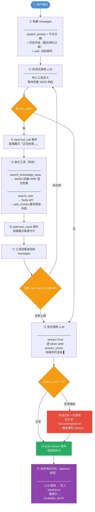

# 从零构建一个真正的 RAG Agent：索引、检索、决策与知识自动内化

> 本文基于一个完整的工程项目展开，覆盖从文档索引构建到在线推理的全流程。面向有工程背景的读者，着重讲设计取舍，而非功能清单。

---

## 一、整体架构：Agent Loop，不是 Workflow

市面上大多数"RAG 产品"本质是固定 Workflow：用户提问 → 向量检索 → 拼 Prompt → LLM 生成。流程写死，LLM 只负责最后一步生成，没有自主决策能力。

这个系统选择了不同的路：**Agent Loop**。每轮由 LLM 自主决定下一步调用哪个工具（或直接回答），工具结果回填消息上下文，LLM 再次决策，循环直到给出最终答案。

```
用户问题
   ↓
LLM 决策（有工具可用）
   ├── 调用 search_knowledge_base → 返回本地 chunk
   ├── 调用 search_web           → 返回网页摘要
   └── 直接回答（无需工具）
   ↓（工具结果写回 messages）
LLM 再次决策 → 循环至 max_tool_rounds 或直接输出答案
```

两个工具：
- `search_knowledge_base`：混合检索本地向量库，适合 AI/ML 原理类问题
- `search_web`：Tavily API 联网搜索，适合实时信息

以及一个异步机制：**知识自动内化**，`search_web` 成功后，结果经 LLM 提炼写入本地知识库，下次同类问题优先从本地命中，越用越快。

---

## 二、索引构建

### 文档加载

支持 `.txt`、`.md`、`.pdf` 的递归扫描，`.md` 文件额外解析 YAML frontmatter：

```python
def _parse_frontmatter(content: str):
    if not content.startswith("---"):
        return {}, content
    end = content.find("\n---", 3)
    meta = {}
    for line in content[3:end].strip().splitlines():
        if ":" in line:
            k, v = line.split(":", 1)
            meta[k.strip()] = v.strip()
    return meta, content[end + 4:].lstrip("\n")
```

frontmatter 里的 `topic`、`type`、`description` 字段会写入向量库 payload，后续检索时用于过滤和路由。

### Chunking 策略：段落合并，超长回退句子切分

`MAX_CHUNK_SIZE = 800`，核心逻辑是**按双换行符切段落，贪心合并**：

```python
for para in paragraphs:
    if len(para) > MAX_CHUNK_SIZE:
        # 超长段落：按句子切（。！？\n）
        for part in _split_long_paragraph(para):
            chunks.append({"text": part, "source": source})
    elif len(current) + len(para) + 2 <= MAX_CHUNK_SIZE:
        current = (current + "\n\n" + para) if current else para
    else:
        chunks.append({"text": current.strip(), "source": source})
        current = para
```

**为什么没有 overlap**：重叠设计的出发点是避免语义跨 chunk 丢失，但它会导致相邻 chunk 在 BM25 里重复计分，同时增加索引体积。本项目知识库是结构化的技术文档，每个段落本身语义完整，段落间跳转由 LLM 在多 chunk 上下文里完成，不需要 overlap 来弥补边界问题。

### Embedding：BAAI/bge-small-zh-v1.5，512 维

文档向量化有两条路：调用外部 API（如 OpenAI Embedding）或加载本地模型（如 SentenceTransformer）。两者在延迟、成本、隐私、离线能力上各有取舍：

| 维度 | 本地模型（SentenceTransformer） | API 服务（OpenAI Embedding） |
|------|-------------------------------|------------------------------|
| **延迟** | 首次加载 ~1-2s，后续批量推理极快 | 每次网络 RTT，批量时受并发限制 |
| **成本** | 一次性下载，运行零费用 | 按 token 计费（Ada-002 约 $0.0001/1K token） |
| **向量维度** | 512 维（bge-small-zh-v1.5） | 1536 维（Ada-002）/ 3072 维（3-large） |
| **中文效果** | 优秀（bge 专为中文语义检索训练） | 较好（多语言混合训练） |
| **英文效果** | 足够（技术文档场景） | 优秀 |
| **离线可用** | ✅ 完全离线 | ❌ 依赖网络 |
| **数据隐私** | ✅ 数据不出本地 | ❌ 文本发送到第三方服务 |
| **部署复杂度** | 需预下载模型文件（~95MB） | 只需 API Key |
| **向量存储开销** | 低（512 维 × float32 = 2KB/条） | 高（1536 维 = 6KB/条） |

本项目选择本地模型，核心理由是**离线优先 + 零边际成本**。模型选型上，最初选用 `all-MiniLM-L6-v2`（384 维），但该模型以英文语料训练，对中文的处理是逐汉字切 token，没有语义组合能力，中文语义召回质量差。

知识库以中文技术文档为主，因此切换为 `BAAI/bge-small-zh-v1.5`（512 维）。bge 系列由北京智源研究院发布，专为中文语义检索场景训练，MTEB 中文评测榜首梯队，模型体积仅 95MB，接近 MiniLM 的 4 倍精度但体积只增加了 4 倍。

主流中文 Embedding 模型对比：

| 模型 | 维度 | 中文效果 | 模型大小 | 说明 |
|------|------|----------|----------|------|
| `all-MiniLM-L6-v2` | 384 | ❌ 差 | 22MB | 纯英文训练，逐汉字切token |
| `BAAI/bge-small-zh-v1.5` | 512 | ✅ 好 | 95MB | 中文专用，MTEB 榜首梯队，**本项目选用** |
| `BAAI/bge-base-zh-v1.5` | 768 | ✅✅ 更好 | 400MB | 精度更高，内存占用翻 4 倍 |
| `shibing624/text2vec-base-chinese` | 768 | ✅ 好 | 400MB | 国内常用，效果接近 bge-base |
| `paraphrase-multilingual-MiniLM-L12-v2` | 384 | ⚠️ 一般 | 118MB | 多语言但中文非强项 |

```python
model_name = os.getenv("EMBEDDING_MODEL", "BAAI/bge-small-zh-v1.5")
os.environ.setdefault("TRANSFORMERS_OFFLINE", "1")  # 模型已缓存，禁止联网检查更新
_embedder = SentenceTransformer(model_name)
```

`TRANSFORMERS_OFFLINE=1` 的作用是禁止每次启动时联网检查模型更新，避免在无网络环境下因超时阻塞应用启动。

**换模型后的向量库迁移**：向量维度从 384 变为 512，两套维度的向量不能混用，需要全量重建。但知识库中存在只在向量库中的数据（`web_cache` 类型，无源文件），不能简单删库，需要：读出全量 `(id, text, metadata)` → 删旧 collection → 用新模型 re-encode → 按原 metadata 写回。项目提供了 `scripts/migrate_embeddings.py` 完成这个操作，实测 283 条记录迁移耗时约 15 秒。

### 向量库双后端：连通性探测自动切换

```python
@functools.lru_cache(maxsize=1)
def _use_qdrant() -> bool:
    if not (os.getenv("QDRANT_URL") and os.getenv("QDRANT_API_KEY")):
        return False
    try:
        client = QdrantClient(url=..., api_key=..., timeout=5)
        client.get_collections()  # 主动探测连通性
        return True
    except Exception as e:
        _logger.warning("qdrant: connection failed (%s), falling back to ChromaDB", e)
        return False
```

`lru_cache(maxsize=1)` 保证进程级单例，探测只在第一次调用时发生。ChromaDB 作为本地开发后端，Qdrant Cloud 作为生产后端，切换无需改代码。

### chunk ID 生成策略

chunk ID 按数据类型分两种生成策略：

| 类型 | ID 格式 | 示例 | 设计原因 |
|------|---------|------|----------|
| **knowledge_base**（本地文档） | 全量：`chunk_{i}`<br>增量：`chunk_{filename}_{i}` | `chunk_0`、`chunk_rag_intro.md_0` | 全量重建先清空整库再写入，连续序号即可，文件名在 payload `source` 字段中；增量更新需按文件删旧写新，用文件名做前缀隔离命名空间，精准定位该文件的所有 chunks |
| **web_cache**（联网搜索结果） | `web_{md5(source+text[:64])}` | `web_3a9f...` | 内容寻址，相同来源+相同内容生成相同 ID，天然实现幂等 upsert，同一页面多次搜索不重复写入 |

**Qdrant ID 转换**：Qdrant 的 point ID 只接受 `uint64` 或 UUID，而业务层使用含语义的字符串 ID。转换方式是取字符串 md5 的前 16 位十六进制转 int，碰撞概率极低（$2^{64}$ 空间），同时在 payload 里保留原始 `_str_id` 供查询时回传：

```python
numeric_id = int(hashlib.md5(uid.encode()).hexdigest()[:16], 16)
payload = {"document": doc, "_str_id": uid, **meta}
```

---

## 三、混合检索：BM25 + 向量，RRF 融合

### 为什么要混合

向量检索擅长语义相似，但对精确的专有名词（如 "BM25"、"HNSW"、具体模型名）往往不如关键词匹配准确。BM25 相反，对语义模糊的查询效果差。两者互补，混合后覆盖更全。

### BM25 内存索引与主动失效

BM25 索引从向量库全量拉数据，在进程内存里构建，避免重复 IO：

```python
_bm25_cache: Tuple = None  # (bm25, all_ids, all_texts, all_metas)

def _get_bm25() -> Tuple:
    global _bm25_cache
    if _bm25_cache is None:
        _bm25_cache = _build_bm25()  # 全量 scroll + BM25Okapi 构建
    return _bm25_cache

def invalidate_bm25() -> None:
    global _bm25_cache
    _bm25_cache = None  # 置 None，下次查询时懒重建
```

每次 `index_single_document` 或 `add_chunks` 完成后都会调用 `invalidate_bm25()`，确保缓存与向量库一致。如果 BM25 缓存有 ID 在向量库里找不到（极端情况下），会在组装结果时检测到并主动触发失效。

### 分词算法选型：为什么选 jieba posseg

BM25 的效果上限由分词质量决定。分词粒度太粗，索引词表不完整；保留太多虚词，IDF 噪音拉低匹配精度。

#### 主流中文分词方案对比

| 方案 | 原理 | 优点 | 缺点 |
|------|------|------|------|
| **按标点/空白切分** | 正则分割 | 零依赖，极快 | 中文整句作为一个词元，BM25 对中文基本失效 |
| **jieba 精确模式** | HMM + 词典 | 轻量，分词准确 | 保留虚词（"的"/"了"/"是"），需配合停用词表 |
| **jieba + 手写停用词表** | 精确模式 + 词表过滤 | 可控 | 停用词表需人工维护，覆盖不全，领域迁移成本高 |
| **jieba posseg（词性标注）** | HMM + 词性感知 | API 内置虚词识别，无需词表 | 略慢于纯分词，首次加载有初始化开销 |
| **HanLP / LTP** | 深度学习 | 分词精度最高 | 模型体积大（数百 MB），推理慢，引入重依赖 |
| **Elasticsearch / Lucene IK** | 持久化倒排索引 | 工业级，增量更新 | 需要独立服务，架构复杂度高 |

#### jieba 四种分词模式

jieba 提供四种分词/关键词 API，各有适用场景：

| 模式 | API | 切分策略 | 词元数量 | 适用场景 |
|------|-----|----------|----------|----------|
| **精确模式** | `jieba.cut(text)` | HMM + 词典，力求最精准切分，不重叠 | 适中 | 文本分析、BM25 索引基础 |
| **全模式** | `jieba.cut(text, cut_all=True)` | 把所有可能的词全部切出，允许重叠 | 最多 | 搜索引擎召回扩展 |
| **词性标注模式** | `jieba.posseg.lcut(text)` | 精确模式基础上同时输出每个词的词性 | 与精确模式相同 | 需要过滤虚词的 BM25、信息抽取 |
| **关键词提取** | `jieba.analyse.extract_tags(text, topK=N)` | TF-IDF 打分，只返回权重最高的 topK 个词 | 最少（受 topK 限制） | 摘要生成、文章标签、SEO 关键词 |

四种模式对同一句话的输出对比：

```python
import jieba
import jieba.posseg as pseg
import jieba.analyse

text = "向量数据库的检索原理是什么"

# 精确模式 —— 无重叠，包含虚词
list(jieba.cut(text))
# → ['向量', '数据库', '的', '检索', '原理', '是', '什么']

# 全模式 —— 有重叠，覆盖所有可能词组合
list(jieba.cut(text, cut_all=True))
# → ['向量', '数据', '数据库', '的', '检索', '原理', '是', '什么']

# 词性标注模式 —— 精确分词 + 词性标签
[(w.word, w.flag) for w in pseg.lcut(text)]
# → [('向量','n'), ('数据库','n'), ('的','uj'), ('检索','vn'), ('原理','n'), ('是','v'), ('什么','r')]

# 关键词提取 —— TF-IDF 打分，只返回 topK 个高权重词
jieba.analyse.extract_tags(text, topK=5)
# → ['数据库', '向量', '检索', '原理', '什么']
```

**全模式的问题**：`"数据"` 和 `"数据库"` 同时出现会导致 IDF 权重计算偏差，用于 BM25 索引会引入噪音，不适合精确召回场景。

**extract_tags 用于 BM25 的问题**：它本质是**关键词提取**而非**全文分词**，默认 `topK=20` 会截断长文档中的低频词。同一篇文档建索引时词表不完整，查询词命中率下降；且 topK 是全局参数，短句和长文档被同等截断，行为不一致，不适合全文检索场景。

#### 选择 jieba posseg 的依据

**精确模式 vs 词性标注模式**：两者底层分词算法完全相同，切出的词也完全一样，区别仅在于返回值——精确模式只返回词字符串，词性标注模式额外附带每个词的词性标签，没有额外的分词性能开销。

用精确模式做 BM25 的问题在于：它不知道哪些词是虚词，要过滤"的/了/是/吗/呢"这类噪音词，就必须自己维护一张停用词表。停用词表需要人工整理、领域迁移时要重新补充，且永远有覆盖不全的边界情况。

**核心思路**：用词性过滤替代停用词表。

jieba 的 `posseg` 模块在分词的同时标注每个词的词性（名词 `n`、动词 `v`、形容词 `a`、英文 `eng` 等）。只保留实词类词性，助词（`u`）、连词（`c`）、介词（`p`）、语气词（`y`）等虚词天然被过滤，无需手动维护停用词列表：

```python
import jieba.posseg as pseg

KEEP_PREFIX = {"n", "v", "a", "m"}   # 名词、动词、形容词、数字
KEEP_FLAG   = {"eng", "x"}            # 英文单词、专有符号

words = pseg.lcut("向量数据库的检索原理是什么")
# → [('向量','n'), ('数据库','n'), ('的','uj'), ('检索','vn'), ('原理','n'), ('是','v'), ('什么','r')]

tokens = [w.word for w in words if w.flag[:1] in KEEP_PREFIX or w.flag in KEEP_FLAG]
# → ['向量', '数据库', '检索', '原理', '是']
```

与三种方案的实际效果对比：

```
输入：向量数据库的检索原理是什么

按标点切分：["向量数据库的检索原理是什么"]        # 1个词元，BM25无效
jieba精确模式：["向量","数据库","的","检索","原理","是","什么"]  # 7个，含虚词
jieba posseg过滤：["向量","数据库","检索","原理"]   # 4个，纯实词

输入：HNSW算法的ef_construction参数怎么设置

按标点切分：["hnsw算法的ef_construction参数怎么设置"]  # 1个
jieba posseg过滤：["hnsw","算法","ef","construction","参数","设置"]  # 6个，下划线也被过滤
```

#### 懒加载与降级

jieba 首次 `import` 有约 1~2 秒的词典加载开销，放在 `_tokenize` 函数内部懒加载，只在第一次 BM25 构建时触发，不阻塞应用启动。未安装时自动降级为按标点切分，保证可用性：

```python
try:
    import jieba.posseg as pseg
    ...
except ImportError:
    # 降级：按标点空白切分
    return re.split(r"[，。！？\s]+", text.lower())
```

### RRF 融合

两路各取 `fetch_k = top_k * 2` 候选，合并去重后按 RRF 得分排序：

```python
RRF_K = 60  # 标准平滑常数

def _rrf_score(rank: int) -> float:
    return 1.0 / (RRF_K + rank)

for doc_id in candidate_ids:
    score = 0.0
    if doc_id in vec_ranks:
        score += _rrf_score(vec_ranks[doc_id])
    if doc_id in bm25_ranks:
        score += _rrf_score(bm25_ranks[doc_id])
    rrf[doc_id] = score
```

RRF 的好处是不需要对两路分数做归一化，rank 本身就是无量纲的，公式简单稳定。`k=60` 是学术界的经验值，对较低排名的结果有平滑作用，防止某路因得分绝对值大而压倒另一路。

### 来源监控

每次检索记录 `vec_only / bm25_only / both` 三个计数，异步写入 GitHub Gist 持久化：

```python
vec_only = bm25_only = both = 0
for doc_id in top_ids:
    in_vec = doc_id in vec_ranks
    in_bm25 = doc_id in bm25_ranks
    if in_vec and in_bm25:
        both += 1
    elif in_vec:
        vec_only += 1
    else:
        bm25_only += 1

_logger.info("retrieve: query=%r top_k=%d vec_only=%d bm25_only=%d both=%d",
             query, top_k, vec_only, bm25_only, both, len(chunks))
```

这个比例直接反映混合检索的实际贡献分布：如果 `vec_only` 始终接近 100%，说明 BM25 实际没有起作用，需要检查分词器或 `fetch_k` 参数。

---

## 四、Agent 主循环

### SYSTEM_PROMPT 路由规则

工具路由的核心挑战是：LLM 不知道"当前时间"是什么，也不知道知识库的覆盖范围。直接让 LLM 自由决策会导致路由不稳定——同一个问题有时查知识库，有时查网络。

解决方案是把路由规则显式写在 system prompt 里，作为硬约束：

```
工具路由规则（严格遵守）：
- 实时信息类（天气、新闻、股价、今日日期、最新动态等）→ 直接调用 search_web，禁止先查知识库
- AI/ML/搜索技术原理类 → 优先调用 search_knowledge_base
- search_knowledge_base 返回空结果或相关度低时 → 必须继续调用 search_web，不能直接回答"未找到"
```

同时明确禁止"我将继续搜索"类的过渡回答——LLM 要么调工具，要么给出最终答案，不允许有中间状态的文字输出。

### Tool Calling 循环

```python
for round_num in range(max_tool_rounds + 1):
    resp = client.chat.completions.create(model=model, messages=messages, tools=_active_tools)
    msg = resp.choices[0].message

    if not msg.tool_calls:
        # 无工具调用，流式输出最终答案
        yield from _stream_with_fallback(client, model, messages, ...)
        return

    # 执行工具，结果追加到 messages
    messages.append(msg)
    for tc in msg.tool_calls:
        result = execute_tool(tc.function.name, json.loads(tc.function.arguments))
        messages.append({"role": "tool", "tool_call_id": tc.id, "content": result})

    if round_num >= max_tool_rounds:
        # 达到上限，强制生成答案（不报错，不中断）
        yield from _stream_with_fallback(client, model, messages, ...)
        return
```

达到 `max_tool_rounds` 上限时选择强制生成而不是报错，原因是已经有了若干轮工具结果在上下文里，LLM 完全可以基于这些信息给出答案。报错反而是浪费了前几轮的有效工作。

### 多模型 Fallback

```python
def _should_fallback(exc: Exception) -> bool:
    if isinstance(exc, StreamEmptyError):
        return True
    msg = str(exc).lower()
    fallback_keywords = (
        "quota", "insufficient", "billing",  # 额度不足
        "rate limit", "429",                  # 限流
        "model_not_found", "404",             # 模型不存在
        "timeout", "timed out",               # 超时
    )
    return any(k in msg for k in fallback_keywords)
```

候选模型列表通过环境变量配置：`LLM=bailian/qwen-plus`，`LLM_FALLBACK=bailian/qwen-turbo,qianfan/ernie-speed-pro-128k`。主模型失败时依次尝试备用，每次切换向前端 yield 一个 `retry` 事件，UI 展示切换提示，不中断对话。

### 流式输出与空内容降级

```python
def _stream_with_fallback(client, model, messages, ...):
    stream = client.chat.completions.create(model=model, messages=messages, stream=True)
    chunk_count = 0
    for chunk in stream:
        delta = chunk.choices[0].delta.content
        if delta:
            chunk_count += 1
            yield {"type": "answer_chunk", "content": delta}

    if chunk_count == 0:
        # 空流：降级非流式补一次
        fallback_resp = client.chat.completions.create(model=model, messages=messages)
        content = fallback_resp.choices[0].message.content.strip()
        if content:
            yield {"type": "answer_chunk", "content": content}
        else:
            raise StreamEmptyError(...)  # 触发外层模型 fallback
```

部分模型在高并发或特定问题上会返回空流（非报错），非流式补偿能覆盖这类情况。如果非流式也空，抛出 `StreamEmptyError`，被外层 `_should_fallback` 捕获，触发模型切换。

### 多轮对话

固定窗口 6 轮（12 条消息），只保留 `role` 和 `content`，过滤掉 UI 层附加的 `sources`、`steps` 等字段，避免将前端渲染数据注入 LLM 上下文：

```python
valid = [{"role": m["role"], "content": m["content"]}
         for m in history if m.get("role") in ("user", "assistant") and m.get("content")]
history_messages = valid[-(HISTORY_WINDOW * 2):]
```

### 在线查询完整流程

一次完整的用户提问，内部经历以下步骤：



**两次 LLM 调用的职责分工**：

| 调用 | 模式 | 目的 | 原因 |
|------|------|------|------|
| Tool Calling 决策 | 非流式 | 判断调哪个工具，解析参数 | 需要完整 JSON，流式无法边收边解析 |
| 生成最终答案 | 流式 | 用户看到逐字输出 | 降低感知延迟，长文本下体验差距明显 |

每轮工具调用都是独立的非流式请求，最终答案输出是一次流式请求，一次完整对话最多产生 **5 次 LLM 调用**（4 轮工具决策 + 1 次流式生成）。

---

## 五、知识自动内化

### 整体设计：为什么要内化

RAG 系统的知识库如果是静态的，每次遇到知识库没有覆盖的问题都要走网络搜索，延迟高、费用贵。知识内化的目标是把"搜过的内容"沉淀为本地知识，下次同类问题优先从本地命中。

### 触发与异步化

`search_web` 成功后，通过 daemon 线程异步触发内化，不阻塞主流程回答：

```python
# agent/tools.py
if llm_client and results:
    t = threading.Thread(
        target=internalize_async,
        args=(query, results, llm_client, llm_model),
        daemon=True,
    )
    t.start()
```

入口函数捕获所有异常，静默记录 ERROR 日志后退出，任何内化失败都不会影响用户看到的回答：

```python
def internalize_async(query, results, client, model):
    try:
        _internalize(query, results, client, model)
    except Exception as e:
        _logger.error("knowledge internalization failed: query=%r error=%s", query, e, exc_info=True)
```

### 六步流程

```
search_web 结果
    ↓
Step 1: 实时性判断 → 是实时类？跳过
    ↓
Step 2: LLM 提炼 → 结构化 markdown（≤500字）
    ↓
Step 2.5: 质量过滤 → 拒绝语 / 重复度 / LLM 打分
    ↓
Step 3: 动态路由 → 选目标 .md 文件（或新建）
    ↓
Step 4: 直接追加写入 → 不去重，重复内容由 consolidate_docs.py 周期整理
    ↓
Step 5: 重索引 → index_single_document + invalidate_bm25
    ↓
Step 6: Gist 审计 → 记录内化记录供侧边栏展示
```

**Step 1 — 实时性判断**

硬规则优先，关键词命中直接跳过，避免把天气预报这类内容写入知识库：

```python
REALTIME_KEYWORDS = ["天气", "气温", "股价", "今日", "实时", "weather", "stock price", ...]

combined = (query + " " + titles).lower()
for kw in REALTIME_KEYWORDS:
    if kw.lower() in combined:
        return True  # 实时类，跳过内化

# 硬规则未命中，LLM 兜底判断（yes/no）
response = client.chat.completions.create(
    messages=[{"role": "system", "content": "判断是否属于实时性信息，只回答 yes 或 no"},
              {"role": "user", "content": f"搜索词：{query}\n标题：{titles}"}],
    temperature=0,
)
return "yes" in response.choices[0].message.content.lower()
```

硬规则 + LLM 兜底的组合：硬规则覆盖高频实时词，节省 LLM 调用；LLM 兜底处理硬规则没有列举的边界情况。

**Step 2 — LLM 提炼**

用 Agent 当前使用的主模型（`temperature=0`）提炼搜索结果：

```python
results_text = "\n\n".join(
    f"标题：{r.get('title')}\n摘要：{r.get('snippet')}\nURL：{r.get('url')}"
    for r in results
)
# 要求：markdown 格式 + 去除广告 + 保留核心概念 + 来源 URL + ≤500字
```

提炼而非直接存原文的原因：Tavily 返回的是网页摘要，含大量导航链接、广告、重复声明。LLM 提炼后去噪，写入知识库的是结构化的技术要点，检索质量更高。

**Step 2.5 — 质量过滤**

三层过滤，逐层收紧：

```python
# 层 1：拒绝语检测（LLM 提炼失败时的常见输出）
REFUSAL_PHRASES = ["无法提炼", "无相关内容", "未找到相关", "unable to extract", ...]
for phrase in REFUSAL_PHRASES:
    if phrase.lower() in refined.lower():
        return False  # 跳过

# 层 2：与 query 字符重叠率 >= 0.85（提炼内容就是 query 本身，没有增量价值）
ratio = len(set(refined[:200]) & set(query)) / max(len(set(refined[:200])), len(set(query)))
if ratio >= 0.85:
    return False

# 层 3：LLM 打分（LLM_JUDGE 环境变量配置，有自己的 fallback）
# 全部 judge 模型失败时降级为硬规则通过，不阻断内化
```

**不用长度作为质量指标**：长度过滤会激励模型输出口水话来凑字数，不如直接让 LLM 判断内容是否有技术价值。

**Step 3 — 动态路由到目标文件**

这是整个流程里最有意思的一步。不是把内容写到固定文件，而是让 LLM 从现有文档中选择最合适的目标：

```python
# 扫描 data/docs/ 下所有 .md，读取 frontmatter 里的 description 字段
candidates = []
for path in glob.glob(os.path.join(DOCS_DIR, "**", "*.md"), recursive=True):
    meta = _read_frontmatter(open(path).read())
    if meta.get("description"):
        candidates.append({"path": path, "filename": ..., "description": meta["description"]})

# 把候选列表交给 LLM 选择
options = "\n".join(f"{i+1}. {c['filename']}: {c['description']}" for i, c in enumerate(candidates))
# LLM 回答文件名或 "new"
```

每个 `.md` 文件头部有 YAML frontmatter：

```yaml
---
topic: 搜索与检索算法
description: 覆盖信息检索全链路算法，包括BM25关键词检索、向量语义检索、RRF混合检索融合策略...适用于判断与搜索算法原理相关的知识路由。
type: knowledge_base
---
```

`description` 字段就是这个文件的"技能描述"，LLM 根据它判断内容应该归到哪里。

**没有合适文件时**：先从预定义的领域分类（`_DOMAIN_CATALOG`，10 个技术领域）中匹配，命中则创建对应文件；真正找不到对应领域时才让 LLM 生成新的文件名和 description，新建文件。预定义分类保证了常见技术领域有稳定的文件，避免 LLM 每次都生成语义相近但文件名不同的碎片文件。

**Step 4 — 直接追加写入**

```python
block = f"\n\n---\n## 补充知识（来自网络搜索）\n> query: {query} | 更新时间: {today}\n\n{refined}\n"
with open(filepath, "a", encoding="utf-8") as f:
    f.write(block)
```

写入时不做去重，原因是：

1. **query 相同 ≠ 内容陈旧**：同一 query 隔一段时间搜索，Tavily 可能返回更新的内容，强制去重会阻止知识更新
2. **去重由整理脚本负责**：`consolidate_docs.py` 每 3 天调用 LLM 对文档做语义级整理，合并重复段落、删除冗余内容——这比写入时的 query hash 去重更彻底，能处理语义重复而不仅仅是完全相同的情况
3. **关注点分离**：写入负责"不漏"，整理负责"不冗余"，两个阶段职责清晰

**Step 5 — 增量重索引**

```python
index_single_document(filepath)  # 删旧 chunks → 重新 embedding → upsert
invalidate_bm25()                 # 清 BM25 缓存，下次查询时懒重建
```

只重索引被修改的文件，不影响其他文件的索引。

### 周期整理：consolidate_docs.py

知识内化写入时不去重，由 `scripts/consolidate_docs.py` 负责定期清理：

```python
# 触发条件：3天间隔 + 有文档更新（双重条件，缺一不可）
def _should_run() -> bool:
    last_run = _last_run_ts()

    # 1. 间隔未到，直接跳过
    if last_run > 0 and elapsed_days < INTERVAL_DAYS:
        return False

    # 2. 间隔已到，但若无文档更新则无需整理，节省 LLM 资源
    if last_run > 0 and not _any_doc_updated_since(last_run):
        return False

    return True
```

`_any_doc_updated_since` 扫描 `data/docs/*.md` 的文件 mtime，只要有一个文件在上次运行后被修改过就返回 True。这样如果用户最近没有触发任何搜索，consolidate 脚本虽然被 cron 定期唤醒，也会在毫秒内退出，不消耗任何 LLM 资源。

整理逻辑：对每个超过 `MIN_LINES=60` 行的文件，调用 LLM 做全文整理——合并语义重复段落、统一格式、汇总来源 URL，然后覆写原文件并重新索引。

### web_cache 与内化的区别

两条并行路径，职责不同：

| | web_cache | 知识内化 |
|---|---|---|
| 触发时机 | search_web 成功后立即 | search_web 成功后异步 |
| 写入内容 | 网页原文摘要（未提炼） | LLM 提炼后的结构化 markdown |
| 存储位置 | 向量库（type=web_cache） | data/docs/.md 文件 + 向量库 |
| 生命周期 | TTL 7天 + 上限200条自动清理 | 持久，随知识库长期积累 |
| 目的 | 短期快速命中 | 长期知识沉淀 |

web_cache 保证当次搜索后立即可检索，内化保证提炼后的高质量知识长期留存。

---

## 六、效果评估

### 评估框架：RAGAS

RAG 系统的效果难以用单一指标衡量——检索质量和生成质量是两个独立维度，互相影响但需要分开看。本项目采用 [RAGAS](https://github.com/explodinggradients/ragas) 进行离线评估，它用 LLM 作为评判者，对三个核心指标打分：

| 指标 | 衡量什么 | 计算方式 |
|------|---------|---------|
| **Faithfulness（忠实度）** | 回答是否"只说"了检索内容里有的内容，没有幻觉 | 把答案拆成若干陈述，LLM 判断每条是否可以从 context 推出，取比例 |
| **Answer Relevancy（答案相关性）** | 回答是否真正回答了用户的问题 | LLM 根据答案反推若干问题，用 Embedding 计算这些问题与原问题的余弦相似度均值 |
| **Context Recall（上下文召回率）** | 检索到的内容是否覆盖了标准答案所需的信息 | 把 ground truth 拆成若干句，LLM 判断每句是否能从 context 中找到，取比例 |

三个指标组合形成"不可能三角"的诊断视角：

- Faithfulness 低 → 生成阶段幻觉，LLM 在编造
- Context Recall 低 → 检索阶段问题，召回的不是回答所需的内容
- Answer Relevancy 低 → 回答跑题，或拒绝回答（"参考内容中未提及…"）

### 评估流程

`eval/evaluate.py` 实现了完整的评估管线，分三步：

```
① 问题生成（可选）
   LLM 对每个文档的前 N 个 chunk 生成 question + ground_truth
   结果保存到 eval/questions.json，支持手动修改

② RAG pipeline 推理
   对每道题调用 retrieve() 检索 top-4 context
   再调用 LLM 纯基于 context 回答（不允许模型使用外部知识）

③ RAGAS 评估
   用 LLM_JUDGE 指定的评估模型计算三项指标
   Embedding 复用本地 bge-small-zh-v1.5，避免 API 格式兼容问题
   输出 eval/report.md
```

关键设计：Embedding 用本地 SentenceTransformer 包装成 RAGAS 接口，避免调用百炼 Embedding API 时的格式不兼容问题：

```python
class _STEmbeddings:
    def __init__(self):
        from rag.indexer import get_embedder
        self._model = get_embedder()

    def embed_query(self, text: str) -> list[float]:
        return self._model.encode([text]).tolist()[0]

    def embed_documents(self, texts: list[str]) -> list[list[float]]:
        return self._model.encode(texts).tolist()
```

### 实测结果（2026-04-12，19 题）

| 指标 | 均值 | 期望范围 |
|------|------|---------|
| **Faithfulness** | **0.882** | ≥ 0.85 ✅ |
| **Answer Relevancy** | **0.120** | ≥ 0.70 ❌ |
| **Context Recall** | **0.263** | ≥ 0.60 ❌ |

Faithfulness 达标，说明 LLM 的生成阶段比较克制——在检索内容存在时，不倾向于编造。

但 Answer Relevancy 和 Context Recall 两项显著偏低，需要分开诊断。

### 指标异常原因分析

**Context Recall 低（0.263）的根本原因：知识库覆盖缺口**

逐题查看 report.md 可以发现，19 题中有 12 题的 RAG 回答是"参考内容中未提及…"。这些题的问题来源涵盖 `collaborative_filtering_*.md`、`vector_databases.md`、`search_algorithms.md`，但检索返回的 context 来自其他主题。

这是**知识库覆盖问题，而非检索算法问题**：这些文档在自动生成问题时还存在，但在评估运行时已被删除或不在当前知识库中（`project_evaluation.md`、`vector_databases.md` 等已从 git index 删除）。Context Recall 低是预期内的结果。

**Answer Relevancy 低（0.120）的直接原因：拒绝回答被评为低相关**

RAGAS 计算 Answer Relevancy 的方式是：根据答案内容反推若干问题，再和原问题做 Embedding 余弦相似度。当 RAG 回答是"参考内容中未提及此信息"时，这句话反推出的问题与原问题语义差距极大，得分趋近于 0。

具体看逐题数据：Answer Relevancy 得分为 0 的 13 题，全部对应 RAG 回答为拒绝回答的情况。而 5 道能正常作答的题，Answer Relevancy 均值为 **0.43**，与 Faithfulness 的表现趋势一致。

**有效题目（能正常检索回答的 6 题）对比：**

| # | 问题 | Faithfulness | Answer Relevancy | Context Recall |
|---|------|:---:|:---:|:---:|
| 1 | chunk_overlap 的目的 | 0.50 | 0.54 | 1.00 |
| 2 | 长文档 chunk_size 推荐值 | 1.00 | 0.17 | 1.00 |
| 4 | 什么是 LLM Agent | 0.96 | 0.63 | 1.00 |
| 6 | Multi-Agent 协作模式 | 1.00 | 0.37 | 1.00 |
| 16 | Anthropic 如何区分 Workflow/Agent | 1.00 | 0.00 | 1.00 |
| 18 | BM25 和向量检索各自擅长什么 | 0.83 | 0.42 | 0.00 |

这 6 题的 Context Recall 均值为 **0.83**，说明在知识库覆盖范围内，混合检索的召回能力是正常的。

### 评估局限与改进方向

**当前评估的局限：**
1. **测试集质量依赖 LLM 生成**：自动生成的 ground_truth 本身也可能不准确，LLM 对同一问题可能在不同运行中给出不同答案
2. **测试集与知识库耦合强**：知识库变更后 questions.json 需要重新生成，否则会出现上面的"文件已删除但题目还在"问题
3. **Answer Relevancy 对中文支持有限**：RAGAS 用 Embedding 余弦相似度计算，短答案、文言式中文都会导致偏低

**下一步改进方向：**
- 维护一批手工标注的"黄金问题集"，与知识库版本绑定
- 引入 `Context Precision`（精准率，检索结果中有多少真正有用）补充 Recall 的视角
- 把评估纳入 CI，每次合并知识库变更时自动跑评估，曲线有回退则 Block

---

## 七、工程亮点

### trace_id 全链路追踪

每次 `run_agent` 调用生成一个 12 位 hex trace_id，贯穿整个 Agent 循环：

```python
trace_id = uuid.uuid4().hex[:12]
# 每个关键节点都携带 trace_id
debug(trace_id, "llm_call", round=round_num, model=label)
error(trace_id, "stream_failed", exc=e, round=round_num, ...)
```

日志格式是 JSON 单行，便于 Streamlit Cloud Logs 面板过滤。出错时 trace_id 直接展示给用户，对照后台日志可定位到具体哪一轮工具调用出了问题。

### 检索来源监控

`vec_only / bm25_only / both` 比例持久化到 GitHub Gist，提供跨重启的长期监控。没有这个数据，混合检索是否真的比纯向量检索好，只能凭感觉猜。

### 验收基线测试（全 mock，完全离线）

测试覆盖五类核心行为：实时信息路由、知识库路由、KB 空结果降级、停止信号响应、流式空内容降级。所有测试 mock 掉 LLM 和 Tavily，无需 API Key，CI 环境可直接运行：

```python
@patch("agent.agent._build_candidates")
@patch("agent.tools.search_web")
def test_weather_query_calls_search_web(self, mock_search_web, mock_build_candidates):
    # 验收标准：天气查询必须调用 search_web，不能直接回答
    mock_client.chat.completions.create.side_effect = [
        _make_tool_call_response("search_web", "明天北京天气"),
        _make_answer_response("..."),
        iter(_make_stream_chunks("...")),
    ]
    events = list(run_agent("明天北京天气怎么样", max_tool_rounds=3))
    assert "search_web" in [e["tool"] for e in events if e["type"] == "tool_call"]
```

这类测试的价值在于：换模型、改 prompt、调参数后，可以立即验证已有路由行为是否被破坏，而不是等到用户反馈。

### .env 热重载

本地开发时，启动前清除所有旧环境变量再重新 `load_dotenv`：

```python
if os.path.exists(_env_file):
    with open(_env_file) as f:
        for line in f:
            key = line.strip().lstrip("#;").split("=", 1)[0].strip()
            os.environ.pop(key, None)
load_dotenv(_env_file)
```

这解决了注释掉 `.env` 里某个变量后，旧值仍然残留在环境中的问题。Streamlit Cloud 环境不存在 `.env` 文件，直接走原生环境变量注入，两条路径互不干扰。

---

## 总结

这个系统的核心设计取舍可以归结为几条：

1. **Agent Loop 而非 Workflow**：LLM 自主决策路由，代价是不确定性，收益是灵活性——知识库空结果自动降级联网是免费得到的，不需要额外的 if-else。
2. **混合检索而非纯向量**：BM25 对专有名词的精确匹配是向量做不到的，RRF 融合的实现代价极低，性价比高。
3. **知识自动内化**：把 RAG 从静态知识库变成动态积累系统，搜索过的内容下次优先走本地，减少 API 调用延迟和费用。
4. **所有异步操作异常静默**：内化、Gist 写入、追问建议生成，全部在 daemon 线程里跑，任何失败只记日志，不暴露给用户。核心路径（检索 + LLM 回答）保持干净。
5. **有测试才能安全迭代**：行为测试覆盖关键路由和降级逻辑，换模型或改 prompt 后有客观基线可以对照。
6. **量化评估而非凭感觉**：RAGAS 三指标分别诊断检索和生成两个阶段，Faithfulness 高说明生成不幻觉，Context Recall 低说明检索有覆盖缺口，两者分开看才能定位到真正的瓶颈。
